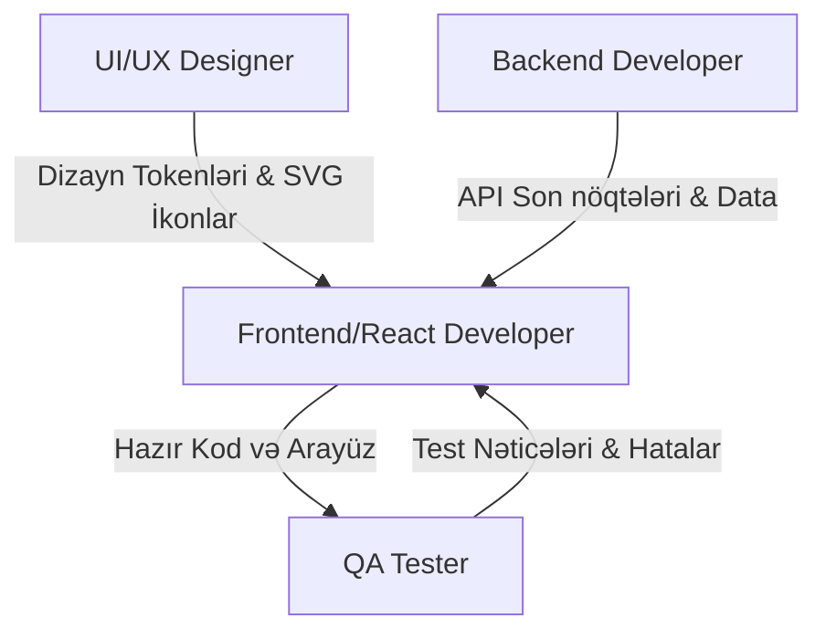

# Antigravity Proyekti Dizayn-Kod Transfer Protokolu (Handoff Master Template)

Bu sənəd, **Antigravity** çərçivəsində inkişaf etdirilən layihələrdə (React/React Native tabanlı Web və Mobil tətbiqlər) Tasarım (UX/UI), Ön Yüz/Mobil (Frontend), Arka Yüz (Backend) və Test (QA) komandaları arasındakı inteqrasiyanı, kod transferi (handoff) standartlarını və keyfiyyətə nəzarət proseslərini tənzimləyən vahid master şablondur.

---

## 1. STRUKTUR VƏ TƏHVİL VERİLƏCƏK SƏNƏDLƏR (DELIVERABLES)

Hər bir layihə yekunlaşdıqda aşağıdakı fayl və qovluq strukturu təhvil verilməlidir:
*   **`README.md`** - Layihənin ümumi məqsədi, quraşdırılması və işə salınması təlimatı.
*   **`Design-System.md`** - Rənglər, tipografiya, boşluqlar və digər dizayn detalları.
*   **`UX-Documentation.md`** - İstifadəçi axınları (User Flow), xüsusi hallar (Edge Cases), yüklənmə (Loading), xəta (Error) və boş vəziyyət (Empty State) ssenariləri.
*   **`Frontend-Handoff.md`** - Ön yüz/React strukturu, komponent arxitekturası və stil qaydaları.
*   **`Backend-Handoff.md`** - API son nöqtələri (Endpoints), sorğu/cavab strukturları, verilənlər bazası şeması.
*   **`QA-Checklist.md`** - Test meyarları, performans və əlçatanlıq hesabatları.
*   **`index.html` & `styles.css`** - Semantik HTML şablonu və modulyar CSS (və ya müvafiq React komponentləri).
*   **`assets/`** - Optimizasiya edilmiş şəkillər, ikonlar və digər media faylları.

---

## 2. LAYİHƏ STANDARTLARI VƏ DİZAYN TOKENLƏRİ

### 2.1. Dizayn Tokenləri (Design Tokens & CSS Variables)
Dizaynda istifadə edilən bütün rənglər, məsafələr və şriftlər CSS dəyişənləri (CSS Custom Properties) şəklində idarə olunmalıdır:

```css
:root {
  /* --- Rəng Paleti (Color Palette) --- */
  --color-primary: #111111;
  --color-primary-rgb: 17, 17, 17;
  --color-accent: #00E5FF;
  --color-accent-hover: #00B2CC;
  --color-background: #FAFAFA;
  --color-surface: #FFFFFF;
  --color-text-main: #1F2937;
  --color-text-muted: #4B5563;
  --color-border: #E5E7EB;
  --color-error: #EF4444;
  --color-success: #10B981;

  /* --- Boşluq Sistemi (Spacing - 8px Grid) --- */
  --space-2: 0.125rem;  /* 2px */
  --space-4: 0.25rem;   /* 4px */
  --space-8: 0.5rem;    /* 8px */
  --space-12: 0.75rem;  /* 12px */
  --space-16: 1rem;     /* 16px */
  --space-24: 1.5rem;   /* 24px */
  --space-32: 2rem;     /* 32px */
  --space-48: 3rem;     /* 48px */
  --space-64: 4rem;     /* 64px */

  /* --- Tipografiya (Fluid Typography) --- */
  --font-family-base: 'Inter', -apple-system, BlinkMacSystemFont, 'Segoe UI', Roboto, sans-serif;
  --font-family-heading: 'Plus Jakarta Sans', -apple-system, sans-serif;
  
  /* Responsive yazı ölçüləri üçün clamp() istifadəsi */
  --font-size-xs: clamp(0.7rem, 0.65rem + 0.2vw, 0.75rem);
  --font-size-base: clamp(0.9rem, 0.85rem + 0.22vw, 1rem);
  --font-size-md: clamp(1.05rem, 1rem + 0.25vw, 1.15rem);
  --font-size-lg: clamp(1.25rem, 1.15rem + 0.4vw, 1.4rem);
  --font-size-xl: clamp(1.5rem, 1.35rem + 0.6vw, 1.75rem);
  --font-size-h2: clamp(1.75rem, 1.5rem + 1vw, 2.25rem);
  --font-size-h1: clamp(2.25rem, 1.85rem + 1.6vw, 3rem);

  /* --- Sərhədlər və Gölgələr (Border Radius & Shadows) --- */
  --radius-sm: 4px;
  --radius-md: 8px;
  --radius-lg: 16px;
  --radius-full: 9999px;

  --shadow-sm: 0 1px 2px 0 rgba(0, 0, 0, 0.05);
  --shadow-md: 0 4px 6px -1px rgba(0, 0, 0, 0.1), 0 2px 4px -1px rgba(0, 0, 0, 0.06);
  --shadow-lg: 0 10px 15px -3px rgba(0, 0, 0, 0.1), 0 4px 6px -2px rgba(0, 0, 0, 0.05);

  /* --- Keçid Effektləri (Transitions) --- */
  --transition-fast: all 0.2s cubic-bezier(0.4, 0, 0.2, 1);
  --transition-normal: all 0.3s cubic-bezier(0.4, 0, 0.2, 1);
}
```

### 2.2. Semantik HTML & Struktur Standartları
Kodun oxunaqlılığı və SEO üçün semantik HTML etiketləri istifadə olunmalıdır:
*   **Yuxarı hissə:** `<header>` və `<nav>`
*   **Ana məzmun:** `<main>`
*   **Müstəqil bölmələr:** Başlığı olan hər bir blok üçün `<section>`
*   **Kart və məqalələr:** Tək başına məna kəsb edən bloklar üçün `<article>`
*   **İnteraktiv elementlər:** `<button>`, `<a href="...">`, `<form>`, `<label>`, `<input>`, `<select>`
*   **Siyahılar:** `<ul>`, `<li>`, `<ol>`

### 2.3. Responsive Layout Standartları
*   Sabit px ölçüləri əvəzinə `%`, `vw`, `vh`, `rem`, `clamp()` və `max-width` istifadə edilməlidir. Sayfa strukturunda **CSS Grid**, daxili düzülüşdə performs üçün **Flexbox** istifadə olunmalıdır.
*   **Kırılma nöqtələri (Breakpoints):**
    *   **Mobil:** 320px – 767px (Elemanlar şaquli - *stacked* düzülür)
    *   **Tablet:** 768px – 1023px
    *   **Desktop:** 1024px+ (Elemanlar üfüqi - *inline* yan-yana düzülür)

### 2.4. Əlçatanlıq (Accessibility - A11y)
*   Bütün `` etiketlərində `alt` atributu mütləqdir. Dekorativ şəkillər üçün `alt=""` yazılmalıdır.
*   Yalnız ikondan ibarət butonlarda və linklərdə `aria-label` yazılmalıdır.
*   Rəng kontrastı WCAG AA standartına uyğun olmalıdır (minimum 4.5:1 kontrast nisbəti).
*   Fokus vəziyyətləri (`:focus`, `:focus-visible`) üçün aydın vizual stildən istifadə olunmalıdır.

### 2.5. Ehtiyat Qaynaqlar (Fallback)
*   **İkonlar:** İlk seçim xüsusi SVG ikonlarıdır. İkinci seçim **Font Awesome v6**, üçüncü seçim isə **Material Icons**-dur.
*   **Şriftlər:** Google Fonts (məs. *Inter*, *Plus Jakarta Sans*) yüklənmədikdə sistem şriftlərinə (`-apple-system`, `BlinkMacSystemFont`, `sans-serif`) geri çəkilməlidir.
*   **Şəkillər (Placeholder):** Hələ hazır olmayan media elementləri üçün **Unsplash** platformasından mövzuya uyğun yer tutucu URL-lər təyin edilir.

---

## 3. EKİB ÜZVLƏRİNİN GÖREV VƏ ÖHDƏLİKLƏRİ



### 3.1. UI / UX Designer
*   Figma / Framer-də bütün rəng, şrift və məsafələri bu şablonun CSS dəyişənlərinə uyğun adlandırın.
*   Bütün şəkilləri WebP (və ya sıxılmış PNG/JPEG), ikonları isə təmiz SVG formatında ixrac edin.
*   Elementlərin `:hover`, `:active`, `:focus`, `:disabled` və boş ekran (empty state) hallarını hazırlayın.

### 3.2. Frontend / Mobile Developer (React)
*   Dizayn tokenlərini `:root` CSS dəyişənlərinə tətbiq edin.
*   BEM (Block-Element-Modifier) metodologiyasına və ya React-də CSS modullarına uyğun adlandırma edin.
*   `aria-label`, `alt` və fokus vəziyyətlərini eksiksiz tətbiq edin.
*   Masaüstündə yan-yana duran elemanların mobildə alt-alta düzülməsini Grid/Flexbox media sorğuları ilə idarə edin.
*   **Tövsiyə olunan qovluq strukturu:**
    ```text
    src/
    ├── assets/
    ├── components/
    ├── pages/
    ├── hooks/
    ├── services/
    ├── api/
    ├── utils/
    └── styles/
    ```

### 3.3. Backend Developer
*   Arayüzün dinamik datası (məs. kart siyahıları, mətnlər) üçün uyğun veritabanı şemalarını qurun.
*   Şəkillərin müxtəlif ölçülərini (`srcset` uyumluluğu üçün) API cavabında qaytaracaq media xidmətləri hazırlayın.
*   Form sahələrindən gələn məlumatların yoxlanılmasını (Validation) və təhlükəsizliyini təmin edin.

### 3.4. QA Tester
*   Masaüstü, mobil və tablet ekranlarında piksel mükəmməlliyini (pixel-perfect) və stacked/inline keçidlərini yoxlayın.
*   Lighthouse ilə kontrast, performans və semantik strukturu yoxlayıb hesabat verin.
*   Butonların kliklənmə, yüklənmə (`loading`) və aktiv olmayan (`disabled`) hallarını test edin.

---

## 4. KOD NÜMUNƏLƏRİ VƏ BOILERPLATE

Aşağıdakı nümunələr yuxarıda qeyd olunan qaydaların tətbiqini nümayiş etdirir:

### 4.1. Semantik `index.html` Quruluşu
```html
<!DOCTYPE html>
<html lang="az">
<head>
  <meta charset="UTF-8">
  <meta name="viewport" content="width=device-width, initial-scale=1.0">
  <title>Antigravity Project Template</title>
  
  <!-- Fontlar və İkon Fallback-ləri -->
  <link rel="preconnect" href="https://fonts.googleapis.com">
  <link rel="preconnect" href="https://fonts.gstatic.com" crossorigin>
  <link href="https://fonts.googleapis.com/css2?family=Inter:wght@400;500;600&family=Plus+Jakarta+Sans:wght@700&display=swap" rel="stylesheet">
  <link rel="stylesheet" href="https://cdnjs.cloudflare.com/ajax/libs/font-awesome/6.4.0/css/all.min.css">
  <link href="https://fonts.googleapis.com/icon?family=Material+Icons" rel="stylesheet">
  <link rel="stylesheet" href="styles.css">
</head>
<body>

  <!-- Semantik Header və Navigasiya -->
  <header class="header">
    <div class="header__container">
      <a href="#" class="header__logo" aria-label="Antigravity Ana Səhifə">
        <svg class="icon icon--logo" viewBox="0 0 24 24" fill="none" xmlns="http://www.w3.org/2000/svg">
          <circle cx="12" cy="12" r="10" stroke="currentColor" stroke-width="2"/>
          <path d="M12 8V16M8 12H16" stroke="currentColor" stroke-width="2" stroke-linecap="round"/>
        </svg>
        <span>Antigravity</span>
      </a>
      <nav class="header__nav" aria-label="Ana Menyu">
        <ul class="header__menu">
          <li class="header__item"><a href="#" class="header__link header__link--active">Layihələr</a></li>
          <li class="header__item"><a href="#" class="header__link">Komandamız</a></li>
          <li class="header__item"><a href="#" class="header__link">Əlaqə</a></li>
        </ul>
      </nav>
      <div class="header__actions">
        <button class="btn btn--icon" aria-label="Axtarış">
          <i class="fa-solid fa-magnifying-glass"></i>
        </button>
        <button class="btn btn--primary">Başla</button>
      </div>
    </div>
  </header>

  <!-- Ana Məzmun Alanı -->
  <main class="main-content">
    <section class="hero" aria-labelledby="hero-title">
      <div class="hero__container">
        <div class="hero__body">
          <h1 id="hero-title" class="hero__title">Gələcəyin Rəqəmsal Məhsullarını Yaradırıq</h1>
          <p class="hero__description">Fikirilərinizi istifadəçi yönümlü interfeyslərə və yüksək performanslı React proqramlarına çeviririk.</p>
          <div class="hero__cta">
            <button class="btn btn--primary btn--large">Layihələri Kəşf Et</button>
            <button class="btn btn--secondary btn--large">
              <span class="material-icons">play_circle</span>
              Videonu İzlə
            </button>
          </div>
        </div>
        <div class="hero__media">
          <picture>
            <source srcset="https://images.unsplash.com/photo-1551434678-e076c223a692?w=800&q=80" media="(min-width: 1024px)">
            <source srcset="https://images.unsplash.com/photo-1551434678-e076c223a692?w=600&q=80" media="(min-width: 768px)">
            
          </picture>
        </div>
      </div>
    </section>

    <!-- Kart Siyahısı -->
    <section class="cards-section" aria-labelledby="section-title">
      <div class="cards-section__container">
        <h2 id="section-title" class="cards-section__title">Xidmət Sahələrimiz</h2>
        <div class="cards-grid">
          
          <article class="card">
            <div class="card__icon-wrapper">
              <i class="fa-solid fa-palette"></i>
            </div>
            <h3 class="card__title">UX/UI Dizayn</h3>
            <p class="card__text">Figma və Framer ilə zənginləşdirilmiş, istifadəçi təcrübəsi yüksək prototiplər və dizayn sistemləri.</p>
          </article>

          <article class="card card--featured">
            <div class="card__icon-wrapper">
              <i class="fa-solid fa-code"></i>
            </div>
            <h3 class="card__title">React & Mobil</h3>
            <p class="card__text">Web və mobil platformalar üçün təmiz, modulyar və performans yönümlü ön yüz kodları.</p>
          </article>

          <article class="card">
            <div class="card__icon-wrapper">
              <span class="material-icons">storage</span>
            </div>
            <h3 class="card__title">Real-time Data</h3>
            <p class="card__text">Təhlükəsiz, miqyaslana bilən məlumat bazası və real-time məlumat axını xidmətləri.</p>
          </article>

        </div>
      </div>
    </section>
  </main>

  <footer class="footer">
    <p>&copy; 2026 Antigravity. Bütün hüquqlar qorunur.</p>
  </footer>

</body>
</html>
```

### 4.2. Modulyar və BEM Uyumlu `styles.css`
```css
/* RESET & BASE STYLES */
*, *::before, *::after {
  box-sizing: border-box;
  margin: 0;
  padding: 0;
}

body {
  font-family: var(--font-family-base);
  font-size: var(--font-size-base);
  line-height: 1.5;
  background-color: var(--color-background);
  color: var(--color-text-main);
  -webkit-font-smoothing: antialiased;
}

h1, h2, h3, h4, h5, h6 {
  font-family: var(--font-family-heading);
  color: var(--color-primary);
  font-weight: 700;
  line-height: 1.2;
}

a {
  text-decoration: none;
  color: inherit;
  transition: var(--transition-fast);
}

img {
  max-width: 100%;
  height: auto;
  display: block;
}

/* BUTTONS */
.btn {
  display: inline-flex;
  align-items: center;
  justify-content: center;
  gap: var(--space-8);
  font-family: var(--font-family-base);
  font-weight: 500;
  font-size: var(--font-size-base);
  padding: var(--space-8) var(--space-16);
  border: 1px solid transparent;
  border-radius: var(--radius-md);
  cursor: pointer;
  transition: var(--transition-fast);
}

.btn--primary {
  background-color: var(--color-primary);
  color: var(--color-surface);
}

.btn--primary:hover:not(:disabled) {
  background-color: rgba(var(--color-primary-rgb), 0.85);
  transform: translateY(-1px);
}

.btn--primary:active {
  transform: translateY(0);
}

.btn--primary:focus-visible {
  outline: 3px solid var(--color-accent);
  outline-offset: 2px;
}

.btn--secondary {
  background-color: var(--color-surface);
  color: var(--color-primary);
  border-color: var(--color-border);
}

.btn--secondary:hover:not(:disabled) {
  background-color: var(--color-background);
  border-color: var(--color-primary);
}

.btn--icon {
  background: transparent;
  border: none;
  padding: var(--space-8);
  border-radius: var(--radius-full);
  color: var(--color-text-muted);
}

.btn--icon:hover {
  background-color: var(--color-border);
  color: var(--color-primary);
}

.btn:disabled {
  opacity: 0.5;
  cursor: not-allowed;
}

/* HEADER & NAV */
.header {
  background-color: var(--color-surface);
  border-bottom: 1px solid var(--color-border);
  position: sticky;
  top: 0;
  z-index: 100;
}

.header__container {
  width: 90%;
  max-width: 1200px;
  margin: 0 auto;
  height: 70px;
  display: flex;
  align-items: center;
  justify-content: space-between;
}

.header__logo {
  display: flex;
  align-items: center;
  gap: var(--space-8);
  font-family: var(--font-family-heading);
  font-size: var(--font-size-lg);
  font-weight: 700;
}

.header__menu {
  display: flex;
  gap: var(--space-24);
}

.header__link {
  color: var(--color-text-muted);
  font-weight: 500;
}

.header__link:hover, .header__link--active {
  color: var(--color-accent);
}

.header__actions {
  display: flex;
  align-items: center;
  gap: var(--space-12);
}

/* HERO SECTION */
.hero {
  padding: var(--space-48) 0;
}

.hero__container {
  width: 90%;
  max-width: 1200px;
  margin: 0 auto;
  display: grid;
  grid-template-columns: 1fr;
  gap: var(--space-32);
  align-items: center;
}

.hero__title {
  font-size: var(--font-size-h1);
  margin-bottom: var(--space-16);
}

.hero__description {
  font-size: var(--font-size-lg);
  color: var(--color-text-muted);
  margin-bottom: var(--space-24);
}

.hero__cta {
  display: flex;
  gap: var(--space-16);
}

.hero__img {
  width: 100%;
  border-radius: var(--radius-lg);
  box-shadow: var(--shadow-lg);
}

/* CARDS */
.cards-section {
  padding: var(--space-64) 0;
  background-color: var(--color-surface);
}

.cards-section__container {
  width: 90%;
  max-width: 1200px;
  margin: 0 auto;
}

.cards-section__title {
  font-size: var(--font-size-h2);
  text-align: center;
  margin-bottom: var(--space-48);
}

.cards-grid {
  display: grid;
  grid-template-columns: 1fr;
  gap: var(--space-24);
}

.card {
  padding: var(--space-32);
  background-color: var(--color-background);
  border: 1px solid var(--color-border);
  border-radius: var(--radius-md);
  transition: var(--transition-normal);
}

.card:hover {
  transform: translateY(-4px);
  box-shadow: var(--shadow-md);
  border-color: var(--color-accent);
}

.card--featured {
  border: 2px solid var(--color-primary);
  background-color: #FFFDF9;
}

.card__icon-wrapper {
  font-size: var(--font-size-xl);
  color: var(--color-accent);
  margin-bottom: var(--space-16);
}

.card__title {
  font-size: var(--font-size-lg);
  margin-bottom: var(--space-12);
}

.card__text {
  color: var(--color-text-muted);
  font-size: var(--font-size-base);
}

.footer {
  text-align: center;
  padding: var(--space-32);
  border-top: 1px solid var(--color-border);
  color: var(--color-text-muted);
  font-size: var(--font-size-xs);
}

/* RESPONSIVE BREAKPOINTS */
@media (min-width: 768px) {
  .cards-grid {
    grid-template-columns: repeat(2, 1fr);
  }
  
  .hero__container {
    grid-template-columns: repeat(2, 1fr);
  }
}

@media (min-width: 1024px) {
  .cards-grid {
    grid-template-columns: repeat(3, 1fr);
  }
  
  .header__container {
    height: 80px;
  }
}
```

---

## 5. PROJE ASSET LİSTESİ VƏ YER TUTUCU URL-LƏR

| Asset Tipi | Təsvir / İstifadə Sahəsi | Mənbə / Təmsili URL |
| :--- | :--- | :--- |
| **Font (Base)** | Əsas mətnlər üçün (Inter) | `https://fonts.google.com/specimen/Inter` |
| **Font (Heading)** | Başlıqlar üçün (Plus Jakarta Sans) | `https://fonts.google.com/specimen/Plus+Jakarta+Sans` |
| **İkon Dəsti 1** | Ümumi interfeys ikonları | Font Awesome v6 (`cdnjs.com`) |
| **İkon Dəsti 2** | Sistem fallback ikonları | Google Material Icons |
| **Görülən Şəkil (Hero)** | Əsas giriş hissəsi üçün | `https://images.unsplash.com/photo-1551434678-e076c223a692?w=1200&q=80` |
| **Görülən Şəkil (Card)** | Xidmət kartları üçün | `https://images.unsplash.com/photo-1460925895917-afdab827c52f?w=600&q=80` |
